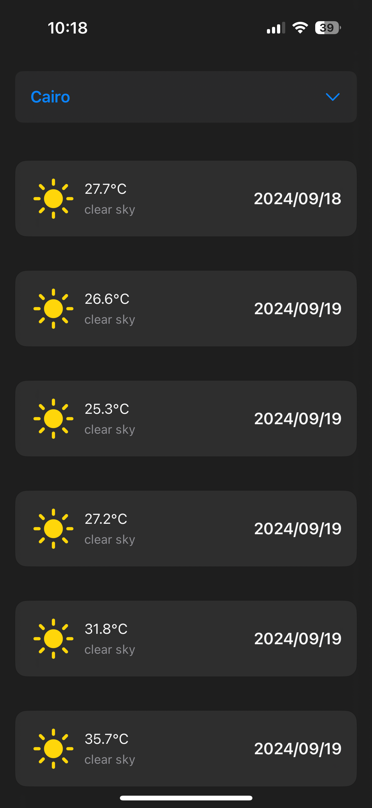
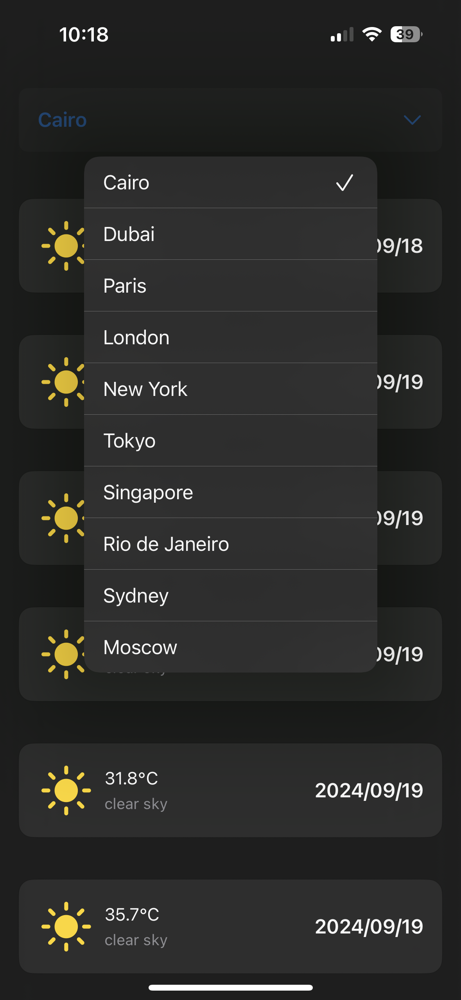
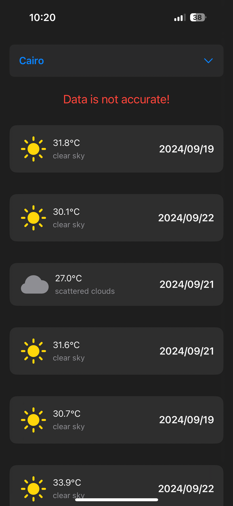

# WeatherApp 🌤

A simple SwiftUI-based iOS application that fetches and displays weather data for multiple cities using a weather API. The app includes offline caching to ensure a smooth user experience, even without an internet connection.

## Features ✨

- 🌎 **City Selection**: A dropdown menu at the top allows users to select a city, whose latitude and longitude are provided in a local JSON file.
- ☀️ **Weather Display**: A LazyVStack lists the weather forecast for the selected city, displaying daily weather information.
- 🌐 **API Integration**: The app fetches data from a weather API using Alamofire, based on the selected city’s latitude and longitude.
- 🗂️ **Caching**: Weather data is cached locally using CoreData to ensure access even when the API fails or the device is offline.
- 🏗️ **Dependency Injection**: The app uses the [Factory](https://github.com/hmlongco/Factory) package for dependency injection, allowing easy management of dependencies and improving testability.

## Screenshots 📸

Here are some screenshots of the app:

  
  
  
  

## Dependencies 📦

- **SwiftUI** – For building the user interface.
- **CoreData** – For caching weather data locally.
- [Alamofire](https://github.com/Alamofire/Alamofire) – For making HTTP network requests.
- [Factory](https://github.com/hmlongco/Factory) – For dependency injection and managing app components.

## License 📄

This project is licensed under the MIT License - see the [LICENSE](LICENSE) file for details.
